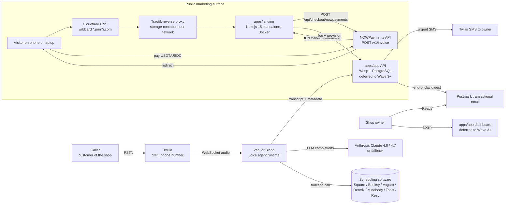

# 02 — Architecture

> PickupCraft operates a per-shop voice agent on a real phone number, books appointments into the shop's existing scheduling software, and reports the day's calls back to the owner. This document covers the system topology, data flows, and deploy plan.

## 1. System diagram (mermaid)



## 2. Components

### apps/landing (Wave 2 — shipping now)

- **Stack**: Next.js 15 App Router · React 19 · Tailwind 3.4 · TypeScript 5.7
- **Routes**:
  - `/` — public landing
  - `/api/checkout/nowpayments` (POST) — creates a NOWPayments hosted invoice for the chosen plan, returns `invoice_url`
  - `/api/webhooks/nowpayments` (POST) — verifies HMAC-SHA512 IPN signature; logs paid/cancelled events for the manual provisioner. Will write to `apps/app` orders table once that surface exists.
- **Build**: multistage Dockerfile → Next standalone runtime → `node server.js` on port 3000.
- **Env**: `NOWPAYMENTS_API_KEY`, `NOWPAYMENTS_IPN_SECRET`, `NEXT_PUBLIC_APP_URL`.

### apps/app (Wave 3+ — deferred)

- **Stack**: Wasp (open-saas template) · React + ShadCN · PostgreSQL · Prisma
- **Surfaces**:
  - **Owner login** — Google OAuth + magic link
  - **Calls inbox** — daily transcripts, urgent escalations, audio playback
  - **Voice settings** — opening line, hours, prices, FAQ overrides; rebuilds the live agent on save
  - **Billing** — base + per-minute usage rendered as monthly NOWPayments invoice
- **Manual loop today** — desk takes the order, voice engineer wires the agent by hand, daily digest comes from Postmark email template.

### Voice runtime

- **Telephony**: Twilio (SIP trunk + DID number per shop)
- **Voice agent runtime**: **Vapi** primary, **Bland** as failover. Both speak the OpenAI/Anthropic LLM API contract.
- **LLM**: Claude 4.6 or 4.7 (per CLAUDE.md model rules — never gpt-3.5/gpt-4-turbo). gpt-5-mini, gemini-2.5-flash as failovers.
- **Voice clone**: ElevenLabs default voices in v1; the shop chooses one of three pre-screened voices (one warm female, one warm male, one neutral). Custom voices in Concierge tier only.
- **Function-call surface** the agent can invoke at runtime:
  - `lookup_calendar_availability(date, duration, service)`
  - `book_appointment(name, phone, datetime, service, notes)`
  - `lookup_pricing(service)`
  - `send_owner_sms(reason, summary)`

### Scheduling integrations

| Software | Industry | Auth | Status |
|---|---|---|---|
| Square Appointments | Salons, beauty | OAuth | Wave 2 launch |
| Booksy | Salons, barbers | API key | Wave 2 launch |
| Vagaro | Beauty, wellness | API key | Wave 2 launch |
| Dentrix | Dentistry | On-prem bridge (Henry Schein One) | Wave 2 launch (manual) |
| Mindbody | Wellness, fitness | OAuth | Wave 2 launch |
| Housecall Pro | Trades | OAuth | Wave 2 launch |
| Jobber | Trades | OAuth | Wave 2 launch |
| OpenTable / Resy / Toast / Tock | Restaurants | API key | Wave 2 launch |
| Eaglesoft, Tebra, Practice Q | Dentistry / clinics | Custom | Wave 3 |

### Data flows

1. **Caller dials shop's published number** → Twilio answers → opens a WebSocket to Vapi.
2. **Vapi greets caller** with the shop's opening line, transcribes audio in real time.
3. **LLM produces the agent's next turn**, possibly calling `lookup_calendar_availability` or `book_appointment`.
4. **Booking is written into the scheduling software** via that integration's API.
5. **End of call**: Vapi POSTs transcript + metadata to `apps/app/api/webhooks/vapi`. (Today: into a flat append-only log on the deploy host.)
6. **6:00 PM local time job**: builds the digest email and sends via Postmark.
7. **Urgent escalation**: an "I want a person" / "this is an emergency" / unhandled-question signal in the LLM trace causes Vapi to call `send_owner_sms` immediately.

### Payment flow

1. Visitor on `apps/landing` clicks the NOWPayments CTA on a tier card (Starter, Growth, or After-Hours).
2. Client → `POST /api/checkout/nowpayments { plan }`.
3. Server calls `POST https://api.nowpayments.io/v1/invoice` with the plan's USD amount, order_id, IPN URL.
4. Server returns `{ invoice_url }` to the client; the client redirects.
5. Customer pays in USDT/USDC on the NOWPayments hosted page (or via card if NOWPayments has the card partner enabled on this account).
6. NOWPayments POSTs IPN to `/api/webhooks/nowpayments` with `x-nowpayments-sig` HMAC-SHA512 over alphabetically-sorted JSON.
7. Server verifies the signature against `NOWPAYMENTS_IPN_SECRET` and logs the verified event (Wave 2). The desk human-provisions the agent.
8. Wave 3+ the IPN handler writes to the orders table and calls a provisioner job.

### Deploy topology

```
github.com/prin7r-projects/voice-agents-local
              │
              ▼  git pull
storage-contabo (161.97.99.120)
  /opt/prin7r-deploys/voice-agents-local/
              │
              ▼  docker compose up -d
Container: voice-agents-local-landing  (Next.js 15 standalone, port 3000 inside container)
              │
              ▼  Traefik (host network mode) discovers via Docker socket
Traefik routes Host(`voice-agents-local.prin7r.com`) → container:3000
              │
              ▼  TLS via Let's Encrypt R12 (HTTP-01 resolver)
Public: https://voice-agents-local.prin7r.com
```

DNS: wildcard `*.prin7r.com → 161.97.99.120` already exists. No per-subdomain record is required.

## 3. Reliability and observability

- **Static landing**: stateless. Container restart is the recovery mechanism.
- **Webhooks**: idempotent — verifying the IPN signature and logging the event is enough; the human provisioner is the system of record in Wave 2.
- **Voice runtime**: fronted by Vapi/Bland, both have their own SLA. We monitor by alarm on Vapi's status page and a synthetic call once a day.
- **Logs**: `journalctl -u docker.service` on storage-contabo captures container stdout. We grep `[PICKUPCRAFT_NOWPAYMENTS_IPN]` for verified-payment events.

## 4. Threat model

| Surface | Threat | Control |
|---|---|---|
| `/api/webhooks/nowpayments` | Forged IPN to mark an order paid | HMAC-SHA512 verification with `NOWPAYMENTS_IPN_SECRET`; reject on mismatch (HTTP 401). |
| `/api/checkout/nowpayments` | Abuse of paid invoice creation as DoS | Plan id is allowlisted; price is server-side from `PLANS`; no user-supplied amount accepted. |
| Env exposure | Leaked `NOWPAYMENTS_API_KEY` | Gitignored `.env`; key only on the deploy host's filesystem; rotated on team change. |
| Voice runtime | LLM jailbreak by adversarial caller | The agent is scoped via system prompt and function-call allowlist. It cannot transfer money, change the script, or speak in a language other than the configured ones. |
| Caller PII | Storage of personal info from calls | Audio retained 30 days; transcripts redacted of PII before delivery to owner; opt-in long-term retention only. |
